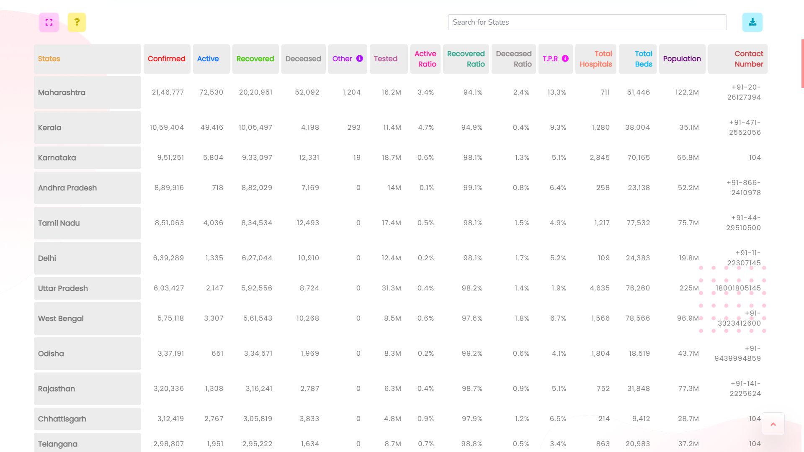
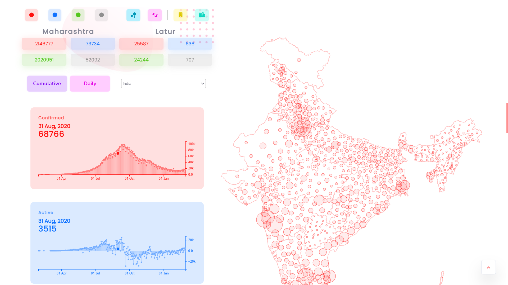
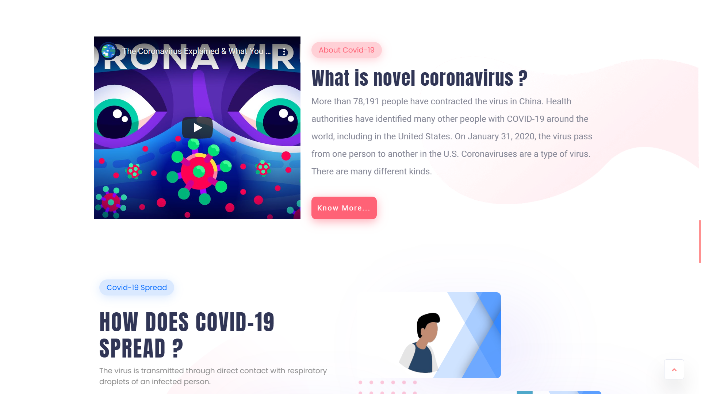
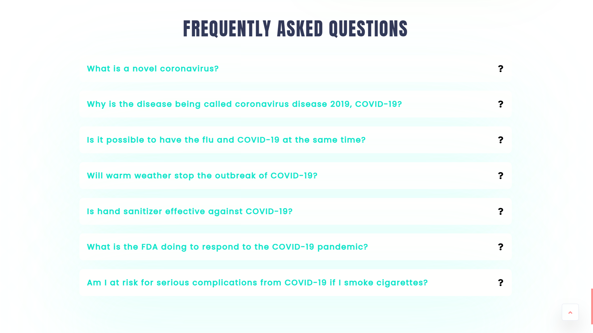

# COV-19-India

<b style="letter-spacing:1.6px">Website : </b><a href="https://debrajhyper.github.io/COV-19-India/">COV-19 | India</a>
<br>

    Coronavirus Outbreak in India: Latest Map and Case Count with real Time 
    update data along with essential information.

<br>

<p align="center">
  
</p>

<br>

# Key Features
- Easy Data representation of Covid cases in India.
- States along with District data in tabular format.
- Generate Table data direct from website (JSON, CSV, PDF)
- Covid Map Visualization of India (District & States)
- Covid Graph Visualization of India
- Information to awareness 

        ╔═╗╔╦╗╔═╗╦ ╦  ╦ ╦╔═╗╔╦╗╔═╗
        ╚═╗ ║ ╠═╣╚╦╝  ╠═╣║ ║║║║║╣ 
        ╚═╝ ╩ ╩ ╩ ╩   ╩ ╩╚═╝╩ ╩╚═╝
        ╔═╗╔╦╗╔═╗╦ ╦  ╔═╗╔═╗╔═╗╔═╗
        ╚═╗ ║ ╠═╣╚╦╝  ╚═╗╠═╣╠╣ ║╣ 
        ╚═╝ ╩ ╩ ╩ ╩   ╚═╝╩ ╩╚  ╚═╝

# Website Info
Developed by <a href="https://github.com/debrajhyper">Debraj Karmakar</a>
<br>

><a href="https://debrajhyper.github.io/COV-19-India/">This</a> is a small effort from my side to keep yourself updated with number of corona cases reported in India so far. Checkout the available APIs <a href="https://covid-19-apis.postman.com/">here</a>. Thankful to <a href="https://github.com/covid19india">@covid19india</a> organization for such a wonderful API. The Open Graph image used is taken from here.
<br>

<br>

<b style="letter-spacing:1.2px">Technology Used :</b>
<ul>
    <li>HTML5</li>
    <li>CSS3</li>
    <li>Bootstrap</li>
    <li>Material UI</li>
    <li>jQuery</li>
    <li>D3</li>
    <li>TopoJSON</li>
    <li>Ajax</li>
    <li>Fetch API</li>
    <li>JavaScript</li>
    <li>Github</li>
    <li>VS Code</li>
    <li>Chrome</li>
</ul>

# API
<b style="letter-spacing:1px">Official Data</b>
* Case counts:
  * <a href="https://api.rootnet.in/covid19-in/stats/latest">api.rootnet.in/covid19-in/stats/latest</a>
  * <a href="https://api.rootnet.in/covid19-in/stats/history">api.rootnet.in/covid19-in/stats/history</a>
  * <a href="https://api.covid19india.org/data.json">api.covid19india.org/data.json</a>
  * <a href="https://api.covid19india.org/v2/state_district_wise.json">api.covid19india.org/v2/state_district_wise.json</a>

* Testing stats:
  * <a href="https://api.rootnet.in/covid19-in/stats/testing/latest">api.rootnet.in/covid19-in/stats/testing/latest</a>
  * <a href="https://api.rootnet.in/covid19-in/stats/testing/history">api.rootnet.in/covid19-in/stats/testing/history</a>
  * <a href="https://api.rootnet.in/covid19-in/stats/testing/raw">api.rootnet.in/covid19-in/stats/testing/raw</a>

* Hospitals & beds:
  * <a href="https://api.rootnet.in/covid19-in/hospitals/beds">api.rootnet.in/covid19-in/hospitals/beds</a>
  * <a href="https://api.rootnet.in/covid19-in/hospitals/medical-colleges">api.rootnet.in/covid19-in/hospitals/medical-colleges</a>

* Contact & helpline:
  * <a href="https://api.rootnet.in/covid19-in/contacts">api.rootnet.in/covid19-in/contacts</a>

<b style="letter-spacing:1px">Unofficial Data</b>

* Unofficial sources: https://api.rootnet.in/covid19-in/unofficial/sources
* Unofficial patient tracing data: https://api.rootnet.in/covid19-in/unofficial/covid19india.org
* Unofficial statewise: https://api.rootnet.in/covid19-in/unofficial/covid19india.org/statewise
* Unofficial statewise history: https://api.rootnet.in/covid19-in/unofficial/covid19india.org/statewise/history

# Screenshots
    
<h3>Dashboard | Data Table</h3>


<h3>Dashboard | Map visualization</h3>


<h3>Cov-19 Information</h3>


<h3>All your queries</h3>


<br>
<br>

```javascript
if (_.isAwesome(thisRepo)) {
  thisRepo.star(); // thanks in advance :p
}
```
<br>

# Conclusion:

<b style="letter-spacing:1px">Here are the key takeaways of this Project</b>

- Working with an HTTP request
- Working with JSON Data (Arrays and Objects)
- Sorting Numeric Data
- Sorting Datatype
- Sorting String and Object arrays
- Doing arithmetic Calculation on Object types
- Nesting Table Dynamically
- Loading component Dynamically on Click
- Use of moment Date Filter
- Export data directly from the webpage
<br>

<br>


>### So I hope you will like this project. And kindly do check my live link to the website. Please feel free to go through the statistics and keep learning and utilize your time. STAY SAFE.


